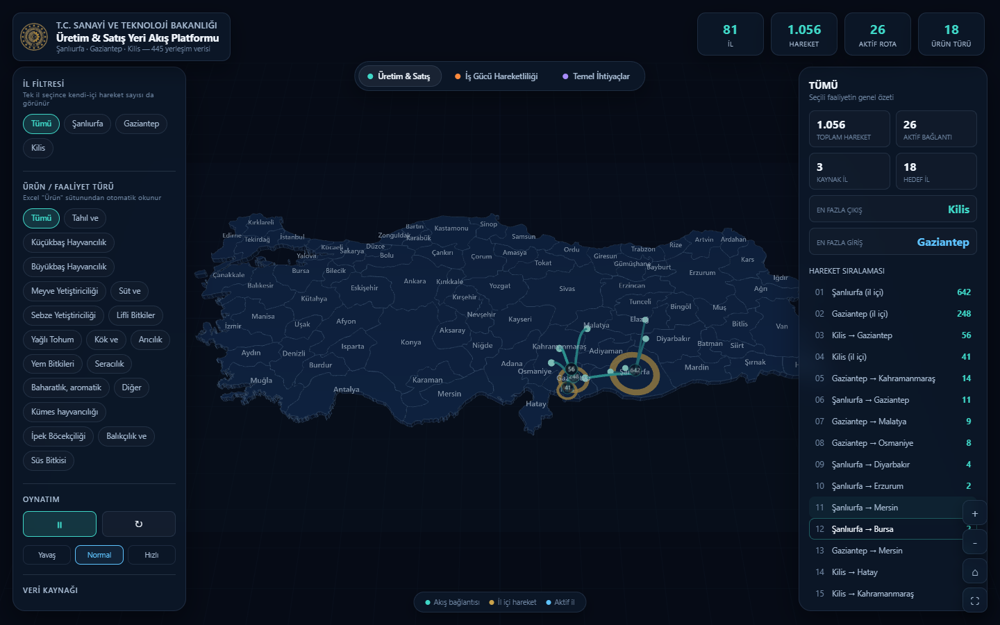

# YER-SİS Interactive Flow Platform

## English

An interactive, three-layer visualization developed during my internship at the Republic of Türkiye Ministry of Industry and Technology. It explores pilot survey data from settlements in Şanlıurfa, Gaziantep, and Kilis through **production and sales flows**, **workforce mobility**, and **access to basic needs**.

**Technologies:** HTML, CSS, JavaScript, Three.js, WebGL  
**Features:** Interactive map, layer switching, filters, and flow exploration.

To run the project, open `index.html` in a browser. An internet connection is needed to load Three.js from its CDN.

## Türkçe

T.C. Sanayi ve Teknoloji Bakanlığındaki stajım sırasında geliştirdiğim üç katmanlı interaktif veri görselleştirme platformu. Şanlıurfa, Gaziantep ve Kilis'teki yerleşimlere ait pilot anket verilerini **üretim ve satış akışları**, **iş gücü hareketliliği** ve **temel ihtiyaçlara erişim** başlıklarında incelemeyi sağlar.

**Teknolojiler:** HTML, CSS, JavaScript, Three.js, WebGL  
**Özellikler:** İnteraktif harita, katman geçişi, filtreler ve akışların incelenmesi.

Çalıştırmak için `index.html` dosyasını tarayıcıda açın. Three.js CDN üzerinden yüklendiği için internet bağlantısı gerekir.

## Files / Dosyalar

- `index.html` — page structure / sayfa yapısı
- `styles.css` — interface styles / arayüz stilleri
- `app.js` — map and interactions / harita ve etkileşimler
- `data.js` — visualization data / görselleştirme verileri
- `assets/` — image assets / görseller
- `YER-SIS_Analiz_Sunumu-guncel.pptx` — internship presentation / staj sunumu
